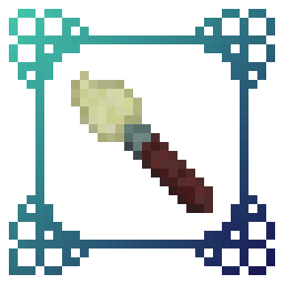

<!-- Improved compatibility of back to top link: See: https://github.com/othneildrew/Best-README-Template/pull/73 -->

<!-- PROJECT SHIELDS -->
<!--
*** I'm using markdown "reference style" links for readability.
*** Reference links are enclosed in brackets [ ] instead of parentheses ( ).
*** See the bottom of this document for the declaration of the reference variables
*** for contributors-url, forks-url, etc. This is an optional, concise syntax you may use.
*** https://www.markdownguide.org/basic-syntax/#reference-style-links
-->

<!-- PROJECT LOGO -->
 

  

  <h3 align="center">ᴀʀᴛᴇ</h3>

  

    Send server resource packs in spoon-sized bites!
     
    <a href="https://thegridsmp.github.io/projects/"><strong>Explore the docs »</strong></a>
     
     
    <a href="https://github.com/TheGridSMP/arte">View Demo</a>
    ·
    <a href="https://github.com/TheGridSMP/arte/issues">Report Bug</a>
    ·
    <a href="https://github.com/TheGridSMP/arte/issues">Request Feature</a>
  

  [![Spigot][spigot-shield]][spigot-url]
  ![Fabric][fabric-shield]
  ![Quilt][quilt-shield]

<!-- TABLE OF CONTENTS -->

  
Table of Contents

  <ol>
    <li>
      <a href="#about-the-project">About Arte</a>
    </li>
    <li>
      <a href="#getting-started">Getting Started</a>
      <ul>
        <li><a href="#prerequisites">Prerequisites</a></li>
        <li><a href="#installation">Installation</a></li>
      </ul>
    </li>
    <li><a href="#usage">Usage</a></li>
    <li><a href="#roadmap">Roadmap</a></li>
    <li><a href="#contributing">Contributing</a></li>
    <li><a href="#license">License</a></li>
    <li><a href="#contact">Contact</a></li>
    <li><a href="#acknowledgments">Acknowledgments</a></li>
  </ol>

<!-- ABOUT THE PROJECT -->
## About Arte

[![Arte Speed Comparison][speed-comparison]][github-url]

So, what does it do? Simple! Let's say you have a BIG server resource pack.
Every time you make a little change, you will have to manually re-host it somewhere, and players will have to fully re-download it.
This can get annoying. Arte splits the resource pack into parts (by namespaces), hosts it directly on your server
and sends each one as a different server resource pack!
> Q: How is this possible? There can only be one server resource pack loaded at one time!

> A: In 1.20.3 Mojang added a new feature that allows servers to send multiple server resource packs at a time! 

Players will only re-download the parts that actually need updating, and apply other server packs.
(Tip: arte can be combined with [Resource Pack Tweaks][rptweaks-url] mod for best server resource pack behaviour)

(<a href="#readme-top">back to top</a>)

<!-- GETTING STARTED -->
## Getting Started

To set up arte on your server follow these steps.

### Prerequisites

This is an example of how to list things you need to use the software and how to install them.
#### On Fabric:
[![Requires Fabric API][fabric-api-shield]][fabric-api-url]

#### On Spigot:
* Requires [Communis][communis-url]

### Installation
[![Modrinth][modrinth-shield]][modrinth-url]
[![GitHub][github-shield]][github-url]
[![Spigot][spigot-shield]][spigot-url]

_Download and install the mod or plugin from [Modrinth][modrinth-url], [Spigot][spigot-url] or [GitHub][github-releases-url] releases._

1. Start your server
2. Open arte's config file
3. Set `address` to your server's public address
4. Open the port specified in config (`6148`) or put already opened port in the `port` field in config.
5. Restart your server

(<a href="#readme-top">back to top</a>)

<!-- USAGE EXAMPLES -->
## Usage

Put your resource pack source (not zipped) in the `arte/resourcepack/` folder and run `/arte reload`.
> [!NOTE]  
> Arte folder can be different depending on your server! If you use Fabric or Quilt, it's folder will be in server's folder.
> If you use Spigot, then arte's folder will be located in `plugins/arte/`

_For more examples, please refer to the [Documentation](https://thegridsmp.github.io/projects/)._

(<a href="#readme-top">back to top</a>)

<!-- ROADMAP -->
## Roadmap

- [x] Initial stable release
- [ ] More zip splitter types
    - [ ] Sized
    - [ ] Smart

See the [open issues][github-issues-url] for a full list of proposed features (and known issues).

(<a href="#readme-top">back to top</a>)

<!-- CONTRIBUTING -->
## Contributing

Contributions are what make the open source community such an amazing place to learn, inspire, and create. Any contributions you make are **greatly appreciated**.

If you have a suggestion that would make this better, please fork the repo and create a pull request. You can also simply open an issue with the tag "enhancement".
Don't forget to give the project a star! Thanks again!

1. Fork the Project
2. Create your Feature Branch (`git checkout -b feature/AmazingFeature`)
3. Commit your Changes (`git commit -m 'Add some AmazingFeature'`)
4. Push to the Branch (`git push origin feature/AmazingFeature`)
5. Open a Pull Request

(<a href="#readme-top">back to top</a>)

<!-- LICENSE -->
## License

Distributed under the Apache License 2.0. See [`LICENSE.md`](LICENSE.md) for more information.

(<a href="#readme-top">back to top</a>)

<!-- CONTACT -->
## Contact

[![Discord][discord-shield]][discord-url]

(<a href="#readme-top">back to top</a>)

<!-- ACKNOWLEDGMENTS -->
## Acknowledgments

* [Choose an Open Source License](https://choosealicense.com)
* [Devin's Badges](https://github.com/intergrav/devins-badges)
* [GitHub Emoji Cheat Sheet](https://www.webpagefx.com/tools/emoji-cheat-sheet)
* [GitHub Pages](https://pages.github.com)

(<a href="#readme-top">back to top</a>)

<!-- MARKDOWN LINKS & IMAGES -->
<!-- https://www.markdownguide.org/basic-syntax/#reference-style-links -->
[modrinth-shield]: https://raw.githubusercontent.com/intergrav/devins-badges/v3/assets/cozy/available/modrinth_64h.png
[modrinth-url]: https://example.com
[spigot-shield]: https://raw.githubusercontent.com/intergrav/devins-badges/v3/assets/cozy/supported/spigot_64h.png
[spigot-url]: https://example.com
[fabric-shield]: https://raw.githubusercontent.com/intergrav/devins-badges/v3/assets/cozy/supported/fabric_64h.png
[quilt-shield]: https://raw.githubusercontent.com/intergrav/devins-badges/v3/assets/cozy/supported/quilt_64h.png
[discord-shield]: https://raw.githubusercontent.com/intergrav/devins-badges/v3/assets/cozy/social/discord-plural_64h.png
[discord-url]: https://discord.gg/CvSkNeQ9uj
[github-shield]: https://raw.githubusercontent.com/intergrav/devins-badges/v3/assets/cozy/available/github_64h.png
[github-url]: https://github.com/TheGridSMP/arte
[github-issues-url]: https://github.com/TheGridSMP/arte/issues
[github-releases-url]: https://github.com/TheGridSMP/arte/releases
[fabric-api-shield]: https://raw.githubusercontent.com/intergrav/devins-badges/v3/assets/cozy/requires/fabric-api_64h.png
[fabric-api-url]: https://modrinth.com/mod/fabric-api
[rptweaks-url]: https://modrinth.com/mod/resource-pack-tweaks
[communis-url]: https://github.com/TheGridSMP/communis
[speed-comparison]: images/screenshot.png
